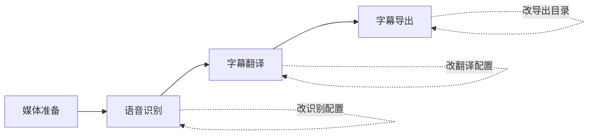
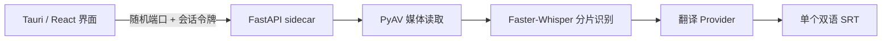

# CaptionNest

CaptionNest 是一个面向 Windows 的本地优先双语字幕应用。它自动识别视频源语言，并生成**一个** SRT：每条字幕上方保留原文，下方写目标语言译文。

```text
42
00:03:18,400 --> 00:03:21,100
We should start now.
我们现在开始吧。
```

## 首版能力

| 项目 | M1–M5 实现 |
|---|---|
| 输入 | Windows 文件选择器 |
| 源语言 | ASR Provider 自动检测，不向用户暴露手动选项 |
| 目标语言 | 简体中文（默认）、英语、韩语 |
| 输出 | `<视频名>.srt`，只生成一个双语字幕 |
| 翻译 | Codex Spark、LM Studio、DeepSeek/OpenAI-compatible |
| 媒体解码 | PyAV wheel 内置媒体库，不要求用户安装 `ffmpeg.exe` |
| 运行模式 | CPU 开箱即用；CUDA 为可选加速 |
| 任务恢复 | 四步流水线；步骤配置、执行记录和产物随任务保存，可从失败处继续 |
| Windows 应用 | Tauri 2 + React + PyInstaller onedir Python sidecar |

若自动识别出的源语言与目标语言相同，任务会在翻译前停止，且不写出无意义的同语字幕。

> 应用直接使用原始视频文件，并将字幕写回源视频同目录；不会复制或上传视频。

## 可恢复任务流水线



界面中的设置分为两层：右侧“新任务默认配置”会记住上次选择；创建任务时会复制为该任务自己的配置，之后修改任务不会反向覆盖默认值。DeepSeek API Key 是唯一例外，只保留在当前页面内存中，不写入浏览器存储、任务详情、日志或磁盘。

每个步骤都展示状态、配置版本、执行次数和产物。失败后可修改对应步骤再“从此步骤重试”；系统复用仍有效的上游产物，只让受影响的步骤及下游重新执行。例如，翻译失败不会重跑语音识别，只修改导出目录也不会重新识别或翻译。

## 普通用户安装

> **当前构建状态：已发布。** [CaptionNest v0.1.0](https://github.com/coconilu/captionnest/releases/tag/v0.1.0) 已提供 Windows x64 安装包。后续版本由 `Prepare Release` 创建不可移动的 annotated tag，再由 tag-ref `Windows Release` 构建并生成 GitHub build provenance；发布后的 Immutable Release 会绑定 tag、commit 和全部 assets。workflow 会从锁定的 PyAV 18.0.0 源码构建自有 wheel，并链接锁定的 LGPL FFmpeg 8.1.2；官方 PyPI wheel 仍会因携带 x264/x265 被门禁拒绝。

可从正式 Release 下载 Windows x64 的 `CaptionNest_*_x64-setup.exe`。维护者只需在 `main` 手动运行 `Prepare Release` 并输入版本号；独立发布 run 会完成测试、许可证门禁、安装冒烟、build provenance、Draft 资产核对和 Immutable Release。安装器设计为：

- 只安装到当前用户，不需要管理员权限；
- 内置 WebView2 bootstrapper；
- 已携带 Python、Faster-Whisper、PyAV 和本地服务；
- 不要求预装 Python、Node.js、Rust、FFmpeg 或 Whisper 环境。

识别模型首次使用时由应用按需下载。Codex Spark 是可选翻译方式：应用只检测本机 Codex；不可用时会显示官方安装入口和“重新检测”，不会静默安装或保存登录凭据。

Faster-Whisper 对长视频默认将 60 秒目标边界吸附到附近自然停顿，核心窗口保持在 45–75 秒，并保留前后 2 秒上下文；没有合适停顿或 VAD 失败时，会确定性回退到原有固定 60 秒切片。系统先从全片分布式窗口投票检测主语言，再锁定语言转写。默认开启的“低置信片段二次识别”只对命中保守规则的局部区间执行一次有界重识别；每个候选最多进入一个请求，二次结果只有严格改善且不损伤语音覆盖时才会采用，失败则保留首轮结果。动态边界与局部重识别都可独立关闭。

可选的“实验性时间轴校正”复用同一次 VAD，在跨窗口去重和二次识别之后收紧静音边界，并有界修正重叠或异常 gap。它不改变字幕文本、分组和稳定 ID，风险输入会回退到原时间轴；当前默认关闭，便于对同一任务做 A/B 对照。规则、上游研究与指标见[时间戳规范化说明](docs/timestamp-normalization.md)。

每个任务还可以配置“每行一个词”的专有词 / Hotwords。应用会去除空项和重复项并执行长度上限校验；同一份词表会传给所有首轮窗口及低置信片段二次识别。空词表不会改变原有 Faster-Whisper 调用参数。

- **逐词重排（默认）**：利用逐词时间戳切开长静音，适合直接观看；
- **分片原始段**：保留模型返回的段落边界，适合诊断和对照。

> M5 产物当前未配置 Windows Authenticode 签名和自动更新。首次安装可能出现 SmartScreen 提示；请从可信 Release 获取，并使用 `gh attestation verify`、`gh release verify-asset` 与同名 `.sha256` 交叉核对。Provenance 证明构建来源和字节摘要，但不等于恶意软件扫描、SBOM 或 Windows 发布者信誉。边界详见 [发布指南](docs/release.md)。

## 开发

Web/API 开发环境：

```powershell
.\scripts\setup.ps1
.\scripts\serve.ps1
```

需要 Vite 热更新时：

```powershell
.\scripts\dev.ps1
```

Windows 桌面开发：

```powershell
npm --prefix apps/web run desktop:dev
```

构建 NSIS 安装包与 SHA-256：

```powershell
npm --prefix apps/web run desktop:build
```

完整环境和命令见 [开发指南](docs/development.md)。核心测试命令：

```powershell
uv run --project apps/sidecar --extra asr --extra dev pytest
uv run --project apps/sidecar --extra dev ruff check apps/sidecar
uv run --project apps/sidecar --extra dev ruff check --config apps/sidecar/pyproject.toml tooling
npm --prefix apps/web run lint
npm --prefix apps/web run build
```

## 运行结构



应用只监听 `127.0.0.1`。桌面壳每次启动生成随机空闲端口与一次性会话令牌，在文档加载前为 `/api/` 请求注入地址和请求头；令牌不会写入磁盘。

## 隐私边界

| 模式 | 留在本机 | 可能发往外部服务 |
|---|---|---|
| Codex Spark | 视频、音频、时间轴、字幕文件 | 分段原文文本 |
| LM Studio | 全部数据 | 无 |
| DeepSeek-compatible | 视频、音频、时间轴、字幕文件 | 分段原文文本 |

API Key 只保留在当前页面内存中，并随单次执行请求传入，不写浏览器存储、任务详情、日志或持久化文件。Codex Spark 复用用户本机 `codex exec` 与现有 ChatGPT 登录，不伪装成 OpenAI API。

## 文档

| 文档 | 内容 |
|---|---|
| [用户指南](docs/user-guide.md) | 安装、模型、Codex、字幕输出与排障 |
| [架构说明](docs/architecture.md) | 模块、信任边界与桌面生命周期 |
| [ASR 诊断契约](docs/asr-diagnostics.md) | VAD 区间、候选诊断与无敏感文本的 A/B 报告 |
| [时间戳规范化](docs/timestamp-normalization.md) | stable-ts 研究溯源、独立实现差异、冻结规则与 A/B 指标 |
| [开发指南](docs/development.md) | 环境、调试、测试与构建 |
| [发布指南](docs/release.md) | NSIS、校验和、签名与许可证门禁 |
| [品牌规范](docs/brand.md) | 名称含义、图标源文件、配色与使用边界 |
| [贡献指南](CONTRIBUTING.md) | 提交与验证约定 |
| [安全策略](SECURITY.md) | 漏洞报告和安全边界 |

## 开源许可

本项目自有代码采用 [Apache License 2.0](LICENSE)。安装包内第三方组件仍适用各自许可证，尤其 PyAV wheel 携带的 FFmpeg 和外部编码库可能受 LGPL/GPL 条款约束；详见 [第三方软件声明](THIRD_PARTY_NOTICES.md)。
