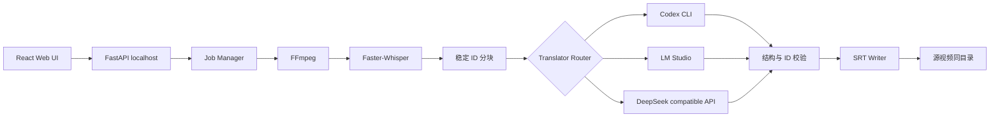
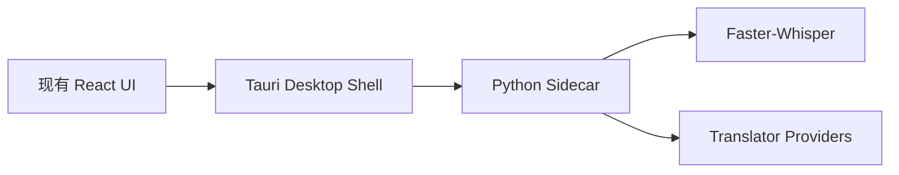

# 架构

## 核心边界

| 模块 | 责任 | 不负责 |
|---|---|---|
| ASR Provider | 音频识别、语言检测、时间戳 | 翻译 |
| Translator Provider | 稳定 ID 到中文译文 | 修改时间轴 |
| Pipeline | 阶段调度、进度、重试、输出 | 保存密钥 |
| FastAPI | 本机 API、任务状态、系统交互 | 长期云端托管 |
| React UI | 输入、配置、状态展示 | 直接访问文件系统 |

## Provider 设计

所有翻译 Provider 接收相同的 `TranslationBatch`，返回相同的 `TranslatedBatch`。流水线在写回 SRT 前强制验证：

1. ID 集合完全一致。
2. 不得新增、遗漏或重复字幕。
3. 译文不能为空。
4. 时间轴只读取 ASR 结果，不读取模型输出。

## 任务数据

- API Key 只存在于创建任务的内存对象中。
- 对外返回的任务视图永不包含 API Key。
- 日志对 URL 做最小展示，不打印请求头和请求体。
- 默认只监听 `127.0.0.1`。

## 桌面封装路线

桌面化时主要替换文件选择、拖放路径授权、进程生命周期和自动更新层；业务流水线保持不变。

