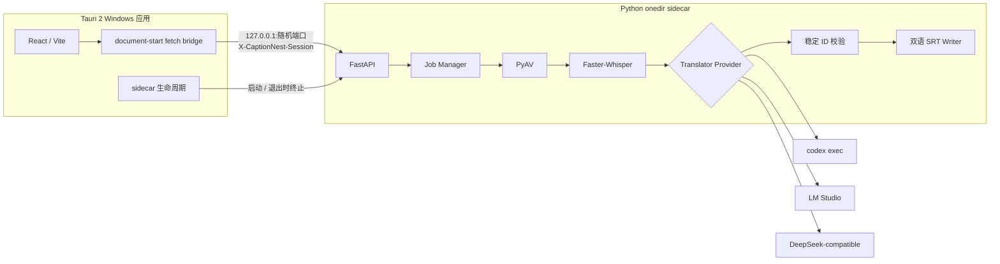
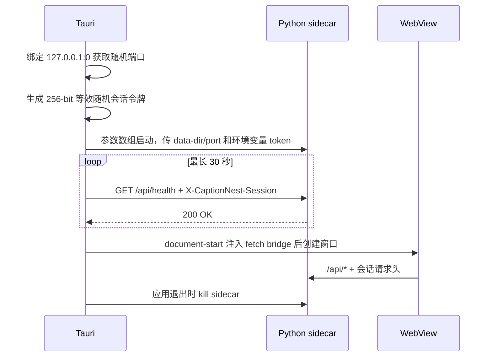

# 架构说明

## 总体结构



## 模块责任

| 模块 | 责任 | 不负责 |
|---|---|---|
| Tauri 壳 | 随机端口/令牌、sidecar 生命周期、应用数据目录、原生插件 | 识别和翻译业务 |
| React UI | 输入、目标语言、Provider、环境与任务状态 | 直接持有时间轴或密钥 |
| FastAPI | 本机 API、会话校验、任务和系统集成 | 对公网监听 |
| PyAV | 从视频容器读取可解码媒体 | 调用系统 `ffmpeg.exe` |
| ASR Provider | 自动语言检测、分段文本和时间戳 | 翻译 |
| Translator Provider | 稳定 ID 到目标语言文本 | 修改时间轴 |
| Pipeline | 阶段调度、进度、失败清理、唯一产物路径 | 持久化 API Key |
| SRT Writer | 原文在上、译文在下的单文件输出 | 再次切分时间轴 |

## 桌面进程生命周期



Tauri 只在带令牌的健康检查返回 200 后创建窗口。这样既避免端口竞态把 WebView 接到其他进程，也避免页面早于 API 就绪。sidecar 的 stdout/stderr 只被排空，不落盘，避免用户路径进入持久日志。

## 数据与安全边界

| 边界 | 约束 |
|---|---|
| 网络 | sidecar 固定监听 `127.0.0.1`；桌面模式所有 `/api/**` 必须带随机令牌 |
| WebView | 初始化脚本只重写本应用或本机后端的 `/api/` 请求，不向外部域名附加令牌 |
| 密钥 | API Key 仅存在于任务内存，不出现在 JobView、日志和磁盘 |
| 外部进程 | 全部使用参数数组与 `shell=False` 等价方式；禁止拼接 shell 命令 |
| 时间轴 | 由程序持有；模型只能翻译稳定 ID 文本；写出前严格校验 ID 集合 |
| 文件 | 默认输出源视频同目录；上传副本则输出到应用数据目录中的副本旁 |
| 模型 | 保存到 Tauri 应用数据目录，下载采用临时目录、校验与原子替换 |

## 打包布局

```text
CaptionNest 安装目录/
├─ captionnest.exe                 # Tauri 主程序
├─ captionnest-sidecar.exe         # externalBin，PyInstaller bootloader
├─ _internal/                      # Python、包、PyAV/FFmpeg、CTranslate2
├─ LICENSE
├─ THIRD_PARTY_NOTICES.md
├─ FFMPEG_BUILD_INFO.txt
└─ licenses/
```

PyInstaller 使用 onedir，不使用 onefile 的每次启动临时解压。安装包不携带 Whisper 模型、Codex、CUDA/cuDNN 或 LM Studio；它们分别按需下载、用户安装或作为可选环境使用。

## Provider 契约

所有翻译 Provider 接收同一 `TranslationBatch` 并返回 `TranslatedBatch`。SRT 写回前必须满足：

| 检查 | 失败结果 |
|---|---|
| ID 集合完全一致 | 任务失败，不生成文件 |
| 不得新增、遗漏或重复字幕 | 任务失败，不生成文件 |
| 译文非空 | 任务失败，不生成文件 |
| 源语言与目标语言不同 | 同语任务提前失败 |
| 时间轴只来自 ASR | 模型输出中的时间信息被忽略 |
