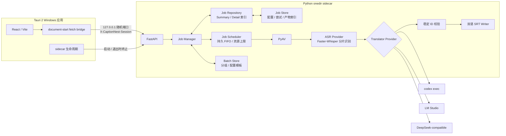
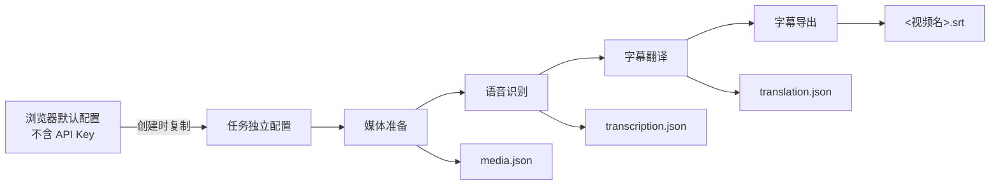
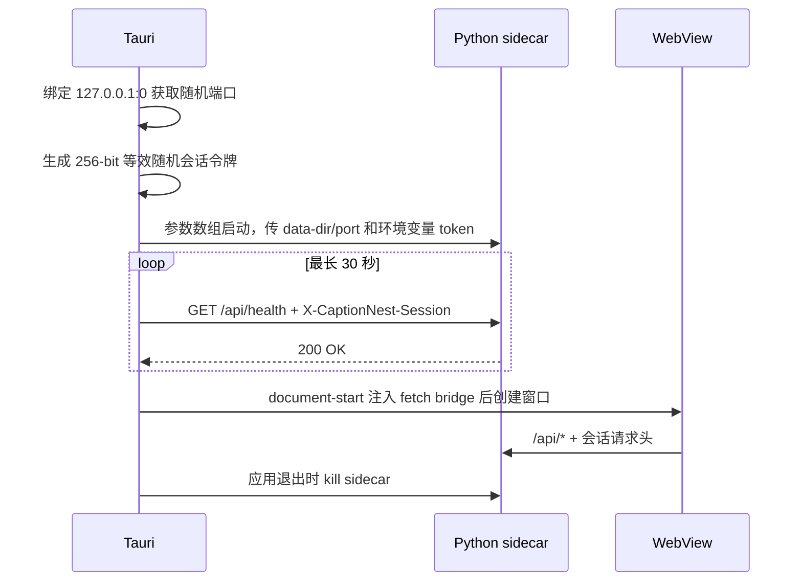

# 架构说明

## 总体结构



## 模块责任

| 模块 | 责任 | 不负责 |
|---|---|---|
| Tauri 壳 | 随机端口/令牌、sidecar 生命周期、应用数据目录、原生插件 | 识别和翻译业务 |
| React UI | 新任务默认配置、任务步骤编辑、环境与任务状态 | 直接持有时间轴或持久化密钥 |
| FastAPI | 本机 API、会话校验、任务和系统集成 | 对公网监听 |
| PyAV | 从视频容器读取可解码媒体 | 调用系统 `ffmpeg.exe` |
| ASR Provider | 自动语言检测、分段文本和时间戳 | 翻译 |
| Translator Provider | 稳定 ID 到目标语言文本 | 修改时间轴 |
| Pipeline | 步骤调度、失效传播、执行记录和可复用产物 | 持久化 API Key |
| Job Scheduler | 持久 FIFO、原子 claim、有限 Job worker 与分步骤资源令牌 | 为每个排队任务创建无限后台 Task |
| Job Repository | 旧 JSON 兼容、Job 内存索引以及轻量 Summary 构造 | 承担识别或翻译业务 |
| Job Store | 原子保存任务配置、步骤状态、尝试记录和产物索引 | 保存运行时密钥 |
| Batch Store | 原子保存批次分组、Job ID 和创建时配置模板 | 把多个媒体时间轴合成一个 Job |
| SRT Writer | 原文在上、译文在下的单文件输出 | 再次切分时间轴 |

## 任务流水线与失效规则



任务元数据保存在 `<data-dir>/jobs/<job-id>/job.json`，中间产物保存在同任务的 `artifacts/` 目录。每一步记录独立配置、配置版本、状态、执行尝试、产物指纹与上游指纹；更新配置后按依赖关系标记下游产物为过期。

| 变更或失败位置 | 保留 | 重新执行 |
|---|---|---|
| 媒体配置 | 无下游产物可复用 | 媒体、识别、翻译、导出 |
| 识别配置或识别失败 | 有效媒体产物 | 识别、翻译、导出 |
| 翻译配置或翻译失败 | 媒体与识别产物 | 翻译、导出 |
| 导出配置或导出失败 | 媒体、识别与翻译产物 | 仅导出 |

任务创建后先成为草稿，正常“开始生成字幕”会从媒体步骤连续执行到导出；步骤级运行接口则可从指定位置继续。开始请求只把 Job 原子加入持久 FIFO：步骤失效与 queued 状态一次落盘，写前失败会恢复原状态且不登记 completion，写入后才报告错误则通过精确回读确认是否已提交。调度器最多创建配置数量的运行 Task；媒体/导出、CPU ASR、CUDA/auto ASR 和各翻译 Provider 分别受独立 Semaphore 约束，CUDA/auto 默认同时 1 个。应用退出时，尚未 claim 的 `queued` Job 保留顺序；已经运行的 Attempt 标为 `interrupted` 并保留成功上游产物。重启后普通 queued Job 自动恢复，需要 DeepSeek API Key 的 Job 因密钥从不落盘而进入 `waiting_for_input`，等待用户重新输入。删除任务会清理 `job.json` 和内部中间产物，不会把已经写到用户目录的 SRT 当作缓存删除。

队列状态与业务步骤状态分开保存：`queue_status` 表示 draft/queued/running/waiting/completed/failed/cancelled/interrupted，`status` 和每个 Step/Attempt 继续描述任务与流水线结果。旧任务没有 Batch 或队列字段时按 `batch_id=null` 和原 `status` 推导加载，不要求迁移文件。

旧版本写入的 Qwen3-ASR 任务只通过独立的历史配置模型加载，用于保留任务、执行记录和已有产物；新建与更新接口只接受 Faster-Whisper。历史任务重新执行识别前必须先迁移到当前支持的模型，不会重新加载已移除的 Qwen 运行时。

## 多任务查询与批次 API

一个源文件仍对应一个 Job；`BatchManager` 只负责一次多文件提交的分组、公共配置快照、预检和逐 Job 批量动作。Batch 状态在读取时由轻量 Job Summary 聚合，Job 的步骤、Attempt、Artifact、日志和失败仍彼此独立。

| 接口 | 语义 |
|---|---|
| `GET /api/jobs` | 无查询参数时保留旧版完整数组；带 `limit/cursor/status/batch_id/q/updated_after` 时返回轻量 `JobSummaryPage` |
| `POST /api/batches/preflight` | 逐文件验证格式、路径、大小、同批重复项、已存在输出和同名 SRT 冲突，不因单项失败丢失其他结果 |
| `POST /api/batches` | 复制公共配置到每个有效源并创建独立 Job；返回 Batch 与逐项创建结果 |
| `POST /api/jobs/bulk-actions` | 逐 Job 执行 run、cancel、retry_failed、delete 或 update_config，部分失败不回滚其他项 |
| `POST /api/uploads/bulk` | 浏览器多文件上传，逐文件返回成功或错误 |
| `DELETE /api/batches/{id}` | 默认仅解除分组；`delete_jobs=true` 时删除可删除 Job 的内部记录/中间产物，导出的 SRT 永不随 Batch 删除 |

Summary 分页使用固定快照水位与不可变 `(created_at, job_id)` 排序。首屏冻结有序 `JobSummaryView` 副本；不透明 cursor 只携带随机 `snapshot_id`、筛选指纹和偏移，后续页不再用 Job 当前版本重算成员。因而首屏后出现的新成员不会混入本轮，已计入的未读成员即使再次更新也不会丢失；增量窗口固定为 `updated_after < updated_at <= server_time`，新版本只在下一轮返回一次。快照仅驻留当前 Sidecar 进程，TTL 为 5 分钟，最多 64 个快照且合计最多 20,000 个 Summary；过期、重启失效或被 LRU 淘汰的 cursor 明确返回 400。后续页省略筛选参数时沿用首屏条件，显式不匹配会被拒绝。Summary 不含日志、步骤、API Key 或其他运行时秘密。

每个未删除 Job 都持有其规范化 `<输出目录>/<源文件名>.srt` 的输出占用，不只检查同一 Batch。预检、创建、配置更新和运行入队都会重验占用；输出目录必须是目录，已存在目标必须是可覆盖普通文件。`overwrite_existing=true` 只允许当前 Job 覆盖未被其他 Job 占用的普通文件，不能绕过跨 Batch 冲突。删除 Job 后才释放占用；可以通过单项 `export` 修改输出目录。Batch 请求中的 DeepSeek Key 只传给本次内存调度项，不进入 Batch 模板、Job JSON、响应或日志。

Job 首次持久化只进行一次原子写入，失败会回滚内存索引并清理部分目录；磁盘删除成功后才从内存移除。Batch 关联写入失败会补偿删除新 Job。启动时以 `Job.batch_id` 为归属事实，双向修复 `Batch.job_ids`：补入缺失成员、移除失效或错属成员，并把指向不存在 Batch 的 Job 解除分组。

## 桌面进程生命周期



Tauri 只在带令牌的健康检查返回 200 后创建窗口。这样既避免端口竞态把 WebView 接到其他进程，也避免页面早于 API 就绪。sidecar 的 stdout/stderr 只被排空，不落盘，避免用户路径进入持久日志。

## 数据与安全边界

| 边界 | 约束 |
|---|---|
| 网络 | sidecar 固定监听 `127.0.0.1`；桌面模式所有 `/api/**` 必须带随机令牌 |
| WebView | 初始化脚本只重写本应用或本机后端的 `/api/` 请求，不向外部域名附加令牌 |
| 用户默认项 | 版本化写入浏览器本地存储；只保存模型、语言、Provider、Endpoint、超时和导出偏好 |
| 密钥 | API Key 仅存在于当前页面与单次执行内存，不出现在本地存储、JobView、日志和磁盘 |
| 外部进程 | 全部使用参数数组与 `shell=False` 等价方式；禁止拼接 shell 命令 |
| 时间轴 | 由程序持有；模型只能翻译稳定 ID 文本；写出前严格校验 ID 集合 |
| 文件 | 默认输出源视频同目录；上传副本则输出到应用数据目录中的副本旁 |
| 模型 | 保存到 Tauri 应用数据目录；采用固定提交、临时目录、校验与原子替换 |

## 打包布局

```text
CaptionNest 安装目录/
├─ captionnest.exe                 # Tauri 主程序
├─ captionnest-sidecar.exe         # externalBin，PyInstaller bootloader
├─ _internal/                      # Python、包、PyAV/FFmpeg、CTranslate2
├─ LICENSE
├─ THIRD_PARTY_NOTICES.md
├─ FFMPEG_BUILD_INFO.txt
└─ licenses/
```

PyInstaller 使用 onedir，不使用 onefile 的每次启动临时解压。安装包不携带 ASR 模型、Codex、CUDA/cuDNN 或 LM Studio；它们分别按需下载、用户安装或作为可选环境使用。产品界面与公开能力列表只启用 Faster-Whisper。

Faster-Whisper 先从全片分布式抽样窗口投票确定主语言，再以 60 秒为目标、45–75 秒为界生成核心窗口，并保留前后 2 秒上下文。动态模式使用一次共享 VAD 分析将边界吸附到自然停顿；任一所需边界找不到合适停顿或 VAD 失败时，整次识别确定性回退到原有固定 60 秒窗口。跨窗口字幕按核心区中点归属并去重。

首轮去重后，纯函数根据无文本数值诊断标记可疑候选并规划有界请求。未标记候选会阻断核心区合并；每个候选最多重识别一次，上下文至少向两侧各扩展 2 秒，并在任务总预算内确定性扩大。语言固定为首轮检测结果。二次返回跨越核心区时，只保留词中点归属于可替换核心区的有效词；没有可裁剪词时间戳则拒绝该返回。二次候选只有严格改善且在 30 ms 边界容差内完整覆盖首轮已确认语音区间时才替换首轮候选；关系型语音空洞不直接计入片段质量分，只有实际增加 VAD 语音覆盖才算空洞改善。若文本一一相同且没有覆盖改善，只采用更好的质量事实并保留首轮程序时间轴。所有替换完成后再次统一去重，最后才由程序生成稳定字幕 ID。

任务级 `hotwords: string[]` 在 Pydantic 边界完成去空格、去空项、稳定去重和字符上限校验，再以逗号加空格连接为 Faster-Whisper 的单个 `hotwords` 字符串参数。模型加载后、首次识别调用前，还会使用该模型的同一 tokenizer 检查实际 Prompt Token 数；预算按 Faster-Whisper 的 `max_length // 2 - 1` 推导，超限时整次拒绝并只返回 Token 数和上限，不允许依赖上游静默截断。序列化结果在一次识别内只计算一次，所有固定/动态首轮窗口及二次识别都复用该值；空数组则完全省略参数。任务配置保存结构化词表，运行日志、识别产物和 A/B 诊断只允许记录条目数或数值指标。

实验性时间戳规范化在所有去重和二次择优结束后、两种字幕渲染器之前运行。它复用同一次共享 VAD 的非语音补集，以 sample 为单位收紧落入静音的边界，并对重叠、小 gap 或可安全到达的长静音边缘做不超过 300 ms 的确定性调整。逐词字幕仍按规范化前的快照决定分组，因此文本、顺序和稳定 ID 不变；任一结构不安全则保留原边界或整轨回退。该功能默认关闭，不引入 stable-ts、PyTorch 或额外模型调用。三个共享功能全部关闭时才跳过 VAD：`dynamic_chunking=false`、`selective_retry=false` 且 `timestamp_normalization=false`。完整规则和研究溯源见[时间戳规范化说明](timestamp-normalization.md)。

| 边界模式 | 核心窗口 | 上下文 | 失败行为 |
|---|---:|---:|---|
| 动态（默认） | 目标 60 秒，范围 45–75 秒 | 前后各 2 秒并裁剪到音频范围 | 整次回退到固定模式 |
| 固定 | 60 秒；尾段允许更短 | 前后各 2 秒并裁剪到音频范围 | 边界不使用 VAD；二次识别或时间戳规范化开启时仍复用一次 VAD 分析 |

最终可输出两种时间轴：

| 输出模式 | 行为 |
|---|---|
| 逐词重排 | 使用模型逐词时间戳按停顿、时长、字符数和句末标点重新切分；默认 |
| 分片原始段 | 保留模型在每个分片内返回的原始段落边界；用于诊断 |

## Provider 契约

所有翻译 Provider 接收同一 `TranslationBatch` 并返回 `TranslatedBatch`。程序先按稳定 ID 规范化模型输出；
无关的额外 ID 会被忽略，顺序会按源字幕恢复。若仍有缺失、重复或空译文，则自动把当前批次递归拆小重试。
SRT 写回前必须满足：

| 检查 | 失败结果 |
|---|---|
| 多余 ID 或顺序变化 | 按稳定 ID 自动修复并记录警告 |
| 遗漏、重复或空译文 | 当前批次拆小重试；单条仍失败才终止任务 |
| 最终 ID 集合完全一致 | 校验失败则不生成文件 |
| 最终译文非空 | 单条重试后仍为空则不生成文件 |
| 源语言与目标语言不同 | 同语任务提前失败 |
| 时间轴只来自 ASR | 模型输出中的时间信息被忽略 |
