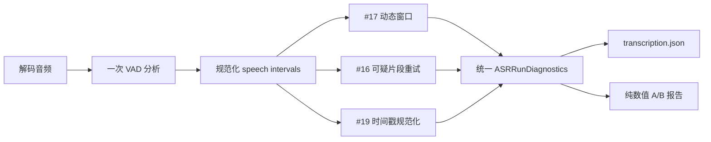

# ASR 区间、诊断与 A/B 契约

本文定义 #17 动态切片、#16 低置信度重试和 #19 时间戳规范化共用的数据边界。公共层只描述事实，不决定具体阈值，也不触发额外模型调用。

## 时间轴原则

| 层级 | 单位 | 语义 |
|---|---|---|
| 解码音频、VAD、切片 | sample | 半开区间 `[start_sample, end_sample)`，避免浮点和毫秒往返误差 |
| 最终字幕 | ms | 继续使用 `SubtitleSegment.start_ms/end_ms` |
| A/B 耗时 | ms | 仅用于实验对照，不替代 #21 的流水线 Attempt 耗时 |

`ASRAudioAnalysis` 只持久化规范化后的语音区间。非语音区间必须通过 `complement_intervals()` 计算，避免 speech 与 non-speech 两份数据产生漂移。

## 持久化结构

| 模型 | 作用 | 不包含 |
|---|---|---|
| `AudioInterval` | sample 级半开区间 | 文本、路径 |
| `ASRAudioAnalysis` | 采样率、总采样数、VAD 状态与 speech 区间 | 重复保存的 non-speech 区间、异常原文 |
| `ASRWindowDiagnostics` | 核心区、上下文、吸附距离、回退标记、候选数 | 音频内容 |
| `ASRSegmentDiagnostics` | 候选 ID、区间、置信度与词时间戳完整度 | 字幕正文、模型原始响应 |
| `ASRDiagnosticsSummary` | 窗口、去重、回退与重试计数 | Prompt、密钥 |
| `ASRExperimentReport` | fixture/hash/config 指纹、耗时与数值指标 | 媒体路径、字幕正文 |

`TranscriptionResult.diagnostics` 是可选字段，旧版 `transcription.json` 无需迁移即可加载。详细诊断保存在识别产物中；Job Step 的 `summary` 只复制不含文本的聚合计数。

## 不变量

- 窗口索引从 0 连续递增；核心区首尾相接、无重叠、无空洞并覆盖完整音频。
- 上下文必须包含核心区，所有窗口和候选片段都位于音频范围内。
- 候选 ID 唯一并强制使用 `candidate-*` 命名空间，不能冒充最终 `seg-xxxxxx` 字幕稳定 ID。
- `NaN`、`+inf`、`-inf` 不得进入持久化诊断；缺失指标使用 `null`。
- A/B `metrics` 只允许有限数值或 `null`，禁止保存字幕、Prompt、响应和本机路径。
- Faster-Whisper 与 VAD 的重量级导入继续留在运行路径，导入 Web 和执行普通单元测试不依赖 GPU 运行时。

## #17 动态切片契约

| 项目 | 规则 |
|---|---|
| 目标边界 | 每个核心以 60 秒为目标，候选切点必须落在至少 350 ms 的自然停顿内 |
| 核心范围 | 动态切片成功时，每个核心均为 45–75 秒且完整覆盖时间轴 |
| 上下文 | 核心前后各扩展 2 秒，并裁剪到音频范围 |
| 回退 | 任一所需边界无合适停顿、VAD 异常或音频短于 45 秒时，整次使用原有固定窗口 |
| 归属与去重 | 沿用片段中点归属核心区和现有跨边界去重，不改变两种输出模式 |
| 开关 | `dynamic_chunking=false` 直接使用固定窗口，且不导入或调用边界 VAD |

停顿选择使用 sample 级确定性排序；同一份音频和配置必须生成相同窗口。`vad_filter` 仍原样传给每个 Faster-Whisper 窗口，它与边界 VAD 是两个独立开关。

## 后续功能接入顺序

| Issue | 复用方式 |
|---|---|
| #17 | 计算一次 VAD，填充 `ASRAudioAnalysis`，生成 `vad_dynamic` 窗口和吸附/回退诊断 |
| #16 | 读取同一 audio/segment 诊断做纯函数判定，累计重试与采用结果计数 |
| #21 | 独立记录 Attempt 单调时钟耗时与模型 Token；不复用 A/B 的 `elapsed_ms` 冒充运行指标 |
| #18 | 每个窗口和二次识别继承同一任务词表；A/B 报告继续只保存数值 |
| #19 | 从 speech 补集得到 non-speech，调整时间戳但不改变文本和 ID |
