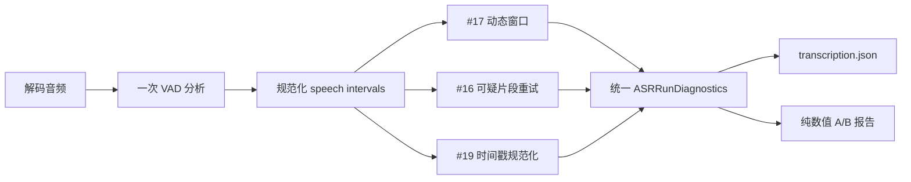

# ASR 区间、诊断与 A/B 契约

本文定义 #17 动态切片、#16 低置信度重试和 #19 时间戳规范化共用的数据边界。公共层只描述事实，不决定具体阈值，也不触发额外模型调用。

## 时间轴原则

| 层级 | 单位 | 语义 |
|---|---|---|
| 解码音频、VAD、切片 | sample | 半开区间 `[start_sample, end_sample)`，避免浮点和毫秒往返误差 |
| 最终字幕 | ms | 继续使用 `SubtitleSegment.start_ms/end_ms` |
| A/B 耗时 | ms | 仅用于实验对照，不替代 #21 的流水线 Attempt 耗时 |

`ASRAudioAnalysis` 只持久化规范化后的语音区间。非语音区间必须通过 `complement_intervals()` 计算，避免 speech 与 non-speech 两份数据产生漂移。

## 持久化结构

| 模型 | 作用 | 不包含 |
|---|---|---|
| `AudioInterval` | sample 级半开区间 | 文本、路径 |
| `ASRAudioAnalysis` | 采样率、总采样数、VAD 状态与 speech 区间 | 重复保存的 non-speech 区间、异常原文 |
| `ASRWindowDiagnostics` | 核心区、上下文、吸附距离、回退标记、候选数 | 音频内容 |
| `ASRSegmentDiagnostics` | 候选 ID、区间、置信度、重复度、VAD/空洞覆盖、词时间戳完整度与重试原因 | 字幕正文、模型原始响应 |
| `ASRRetryRequestDiagnostics` | 请求 ID、候选引用、核心/上下文、原因、择优状态与数值评分 | 字幕正文、原始异常 |
| `ASRDiagnosticsSummary` | 窗口、去重、回退、原因与重试/择优计数 | Prompt、密钥 |
| `ASRExperimentReport` | fixture/hash/config 指纹、耗时与数值指标 | 媒体路径、字幕正文 |

`TranscriptionResult.diagnostics` 是可选字段，旧版 `transcription.json` 无需迁移即可加载。详细诊断保存在识别产物中；Job Step 的 `summary` 只复制不含文本的聚合计数。

## 不变量

- 窗口索引从 0 连续递增；核心区首尾相接、无重叠、无空洞并覆盖完整音频。
- 上下文必须包含核心区，所有窗口和候选片段都位于音频范围内。
- 候选 ID 唯一并强制使用 `candidate-*` 命名空间，不能冒充最终 `seg-xxxxxx` 字幕稳定 ID。
- 重试请求 ID 唯一并使用 `retry-*` 命名空间；引用候选必须已标记、位于请求核心区内且最多被一个请求引用。
- 二次返回候选数必须等于请求明细计数，且每个返回候选都完整位于对应可替换核心区内。
- 请求原因必须等于所引用候选的原因并集；汇总计数必须与候选及请求明细精确一致。
- `NaN`、`+inf`、`-inf` 不得进入持久化诊断；缺失指标使用 `null`。
- A/B `metrics` 只允许有限数值或 `null`，禁止保存字幕、Prompt、响应和本机路径。
- Faster-Whisper 与 VAD 的重量级导入继续留在运行路径，导入 Web 和执行普通单元测试不依赖 GPU 运行时。

## #17 动态切片契约

| 项目 | 规则 |
|---|---|
| 目标边界 | 每个核心以 60 秒为目标，候选切点必须落在至少 350 ms 的自然停顿内 |
| 核心范围 | 动态切片成功时，每个核心均为 45–75 秒且完整覆盖时间轴 |
| 上下文 | 核心前后各扩展 2 秒，并裁剪到音频范围 |
| 回退 | 任一所需边界无合适停顿、VAD 异常或音频短于 45 秒时，整次使用原有固定窗口 |
| 归属与去重 | 沿用片段中点归属核心区和现有跨边界去重，不改变两种输出模式 |
| 开关 | `dynamic_chunking=false` 直接使用固定窗口；若局部重识别仍开启，共享 VAD 仍会运行一次供质量判定使用 |

停顿选择使用 sample 级确定性排序；同一份音频和配置必须生成相同窗口。`vad_filter` 仍原样传给每个 Faster-Whisper 窗口，它与共享边界分析是独立开关。只有 `dynamic_chunking=false` 且 `selective_retry=false` 时，才完全不导入或调用共享 VAD。

## #16 选择性二次识别契约

| 项目 | 规则 |
|---|---|
| 判定 | 普通弱证据至少命中两个独立证据族；硬阈值或 VAD 复合规则可单独触发 |
| 证据 | 低平均对数概率、生成重复/高压缩率、无语音概率与 VAD 冲突、词时间戳不完整、VAD 确认的语音空洞 |
| 请求 | 只合并中间没有未标记候选的重叠目标；核心最长 24 秒，上下文至少前后各 2 秒并在剩余总预算内自适应扩展，单请求最长 28 秒 |
| 总预算 | 最多 12 个请求；总送模时长为 `max(10 秒, 音频时长 × 20%)`，上限 120 秒 |
| 解码 | 固定首轮语言；Beam 至少 8，`temperature=0`、`patience=1.2`、抑制重复、逐词时间戳开启 |
| 所有权 | 二次返回越过核心区时按有效词时间戳裁剪，不能安全裁剪则拒绝；未标记邻居永不进入替换核心 |
| 择优 | 严重度按片段内在证据强度聚合而不随分段数累加；关系型 `speech_gap` 只触发请求、不直接奖励二次评分。平局或更差保留首轮；只有内在质量严格改善，或 VAD 语音覆盖增加超过 30 ms 且内在质量不变差时才采用 |
| 时间轴 | 文本一一相同时采用二次质量事实但保留首轮时间轴；仅当 VAD 确认核心完全没有语音且二次识别为空时才允许删除静音幻觉 |
| 失败 | 单个二次请求失败只记录 `failed`，不保存异常正文并保留首轮结果 |
| 开关 | `selective_retry=false` 不产生额外模型调用，保持旧版单次识别行为 |

阈值属于内部冻结策略，不作为用户设置暴露。首轮候选、二次候选和最终字幕使用不同职责的 ID；最终稳定 `seg-*` ID 仍只由程序在全部择优与去重完成后生成。

## #18 任务级 Hotwords 契约

| 项目 | 规则 |
|---|---|
| API | `ASRSettings.hotwords: string[]`，缺省为空数组；拒绝自由文本和非字符串项 |
| 规范化 | 去首尾空格、去空项、区分大小写稳定去重；拒绝控制字符 |
| 上限 | 最多 50 条、单条最多 64 个 Unicode 字符、去重后总计最多 512 个字符；超限整次拒绝，不静默裁剪 |
| 适配 | 按原顺序以 `, ` 连接为 Faster-Whisper 的 `hotwords` 字符串参数 |
| Token 预算 | 模型加载后用同一 tokenizer 预检；超过 `max_length // 2 - 1` 时在首次识别调用前整次拒绝，错误只含 Token 数与上限 |
| 一致性 | 同一次任务的每个固定/动态首轮窗口及 #16 二次识别使用完全相同的序列化值 |
| 空词表 | 不向 `transcribe` 传 `hotwords` 参数，保持原有调用路径 |
| 隐私 | 任务配置可保存结构化词表；日志、识别产物、诊断和 A/B 报告不得保存正文，只记录数量或数值 |

## 后续功能接入顺序

| Issue | 复用方式 |
|---|---|
| #17 | 计算一次 VAD，填充 `ASRAudioAnalysis`，生成 `vad_dynamic` 窗口和吸附/回退诊断 |
| #16 | 读取同一 audio/segment 诊断做纯函数判定，执行有界局部重识别并累计原因与择优计数 |
| #21 | 独立记录 Attempt 单调时钟耗时与模型 Token；不复用 A/B 的 `elapsed_ms` 冒充运行指标 |
| #18 | 每个窗口和二次识别继承同一任务词表；A/B 报告继续只保存数值 |
| #19 | 从 speech 补集得到 non-speech，调整时间戳但不改变文本和 ID |
