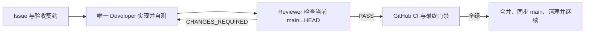

# CaptionNest Code Review 规范

## 目标与角色

每个 PR 都必须经过“唯一 Developer 实现、独立 Reviewer 验收、主控管理 Git 生命周期”的闭环。Reviewer 不参与产品源码修改，Developer 不签发最终验收。

| 角色 | 允许 | 禁止 |
|---|---|---|
| `captionnest-developer` | 实现、修复、增加测试、运行验证 | 自我 `PASS`、擅自扩大范围或发布 |
| `captionnest-reviewer` | 读取真实 Diff、运行检查、报告 finding、签发 verdict | 修改产品源码、替 Developer 修复、擅自合并 |
| 主控 | 固化范围、分派返工、提交/PR/CI/合并与清理 | 用自己的判断绕过 Reviewer 门禁 |



## 审查输入与时效

Reviewer 至少核对：

- 当前 Issue/Epic 的目标、非目标和验收标准。
- `AGENTS.md`、`.opc/project.md`、`.opc/acceptance.md` 及受影响架构文档。
- 当前基线和 HEAD SHA、`main...HEAD` 的提交与完整 Diff、未跟踪文件和生成物。
- Developer 声明的验证命令，但必须自行读取或重跑足以支持 verdict 的证据。

`PASS` 只对报告中记录的 HEAD 有效。新增提交、force-push、rebase 或受版本控制文件变化后，旧 `PASS` 自动失效。

## Finding 优先级

| 级别 | 定义 | 合并影响 |
|---|---|---|
| P0 | 可造成严重安全事件、不可恢复数据损坏或核心功能完全不可用 | 立即阻断 |
| P1 | 高概率错误行为、关键回归、隐私泄露或验收目标未实现 | 阻断 |
| P2 | 有现实触发路径的边界缺陷、兼容性问题、竞态或关键测试缺口 | 阻断 |
| P3 | 非阻断的可维护性、表达或后续优化建议 | 记录；不伪装成必修缺陷 |

每个 finding 必须包含优先级、文件和紧凑行号、触发条件、用户/系统影响、复现或验证方法，以及不扩大 Issue 的修复合同。纯偏好、无现实触发路径或与本 PR 无关的问题不得作为阻断项。

## CaptionNest 专项检查

| 范围 | 必查项 |
|---|---|
| ASR | Faster-Whisper 仍延迟导入；缺少 GPU 依赖不阻塞 UI/单测；窗口、VAD、重试和时间戳规则确定且有界 |
| 时间轴 | 稳定 ID 唯一；文本顺序不变；`0 <= start < end <= duration`；模型不持有或改写时间轴 |
| 翻译 | Provider 契约统一；分片、递归重试和 fallback 不丢结果/计量；结构异常有明确失败路径 |
| 安全 | API Key、Authorization、Prompt、模型原始响应和敏感 stdout/stderr 不进入日志、JSON 或产物 |
| 进程 | 所有外部调用使用参数数组和非 shell 执行；取消、超时和进程回收完整 |
| 持久化 | 原子写入；新增字段兼容旧任务；失败、取消、重启和 stale 传播不会覆盖既有证据 |
| 并发 | 同一 Job 不重复执行；取消和 shutdown 无悬挂任务；资源上限不会被绕过 |
| 输出 | 默认 `<视频名>.srt` 写入源目录；不因目标语言改名；不得静默覆盖其他任务产物 |
| Web | 状态按 Job/Step 隔离；不泄露运行时密钥；真实浏览器验证关键创建、重试、切换和错误流程 |

## 验证证据

先运行受影响区域的目标检查，再运行契约要求的广泛回归。常用完整命令如下：

```powershell
git diff --check origin/main...HEAD
uv run --project apps/sidecar --extra asr --extra dev pytest
uv run --project apps/sidecar --extra dev ruff check apps/sidecar
uv run --project apps/sidecar --extra dev ruff check --config apps/sidecar/pyproject.toml tooling
Set-Location apps/web
npm run lint
npm test
npm run build
Set-Location ../..
cargo fmt --manifest-path apps/desktop/Cargo.toml --check
cargo check --manifest-path apps/desktop/Cargo.toml --target x86_64-pc-windows-msvc --locked
```

UI、桌面、媒体、并发或恢复行为发生变化时，还必须操作真实浏览器/桌面/运行时关键路径，记录环境、步骤和可见结果。源码检查、Mock 或陈旧截图不能单独证明真实流程通过。

| 声明 | 足够证据 | 单独不足 |
|---|---|---|
| 已实现 | 当前真实 Diff、测试和运行行为 | Developer 总结 |
| 构建通过 | 当前命令、退出码和结果 | 仓库里存在构建脚本 |
| UI 可用 | 真实交互、可见状态和必要截图/trace | 只读 React 源码 |
| 安全 | 边界测试、日志/任务 JSON 检查和 Diff | “改动很小” |
| 可合并 | 当前 HEAD 的 Reviewer `PASS` + 所需本地验证 + GitHub CI 全绿 | Draft PR 或旧 PASS |

## Verdict 格式

```text
VERDICT=PASS | CHANGES_REQUIRED | BLOCKED
HEAD=<commit sha>

Findings:
- [P1] 标题 — file:line
  触发条件、影响、复现证据、修复合同

Acceptance evidence:
- criterion → command/artifact/result

Skipped or blocked checks:
- 无；或明确说明缺口及为何不能 PASS

Git state:
- Reviewer 前后状态；确认未修改产品源码
```

`CHANGES_REQUIRED` 必须交还原 Developer。Developer 修复并提供新证据后，Reviewer 对新的 HEAD 重新执行相关检查；旧 finding 关闭不代表自动 `PASS`，还需确认没有新增回归。

## 合并与清理门禁

只有以下条件全部满足才可自动合并：

1. Issue 的必需验收标准都有当前、直接、可复现的证据。
2. Reviewer 对当前 HEAD 给出 `PASS`，无未解决 P0/P1/P2。
3. 所需本地测试、构建和真实流程均通过。
4. GitHub CI 全绿，且没有未解决的阻断 review thread。
5. 合并后切回并快进本地 `main`，确认 `main == origin/main`。
6. 删除已合并的本地与远端功能分支，以及该分支的专用 worktree，然后才能进入下一项。
