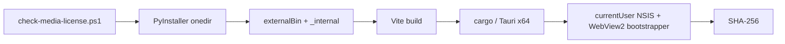

# 开发指南

## 工具链

| 场景 | 必需工具 |
|---|---|
| API / Web | Windows 10/11、Python 3.11–3.12、uv、Node.js 20+ |
| 桌面调试 | 上述工具 + Rust stable 1.77.2+、MSVC Build Tools |
| 安装包 | Windows x64、NSIS（由 Tauri 工具链获取）、网络用于 WebView2 bootstrapper |

系统 `ffmpeg.exe` 不是依赖。ASR Provider 通过 PyAV wheel 解码媒体；GPU 是可选能力。

> PyPI 的官方 PyAV 18 Windows wheel 含 x264/x265，许可证门禁仍会有意阻止它进入 sidecar。正式 `Windows Release` workflow 会先构建并安装锁定的 LGPL 媒体 wheel；本地构建安装包时请按 [媒体运行时说明](../tooling/packaging/media-runtime/README.md) 准备相同 wheel。API / Web 调试和源码测试不受影响；不要为方便开发把 `-AllowGpl` 写入默认脚本。

## 初始化与调试

```powershell
.\scripts\setup.ps1
.\scripts\serve.ps1
```

日常本地运行只启动一个入口：`http://127.0.0.1:8765/`。`serve.ps1` 会先构建前端，停止当前
仓库遗留的 Vite/uvicorn 进程，再让 FastAPI 同时提供 API 和构建后的 Web 页面。

需要 React 热更新时才使用开发模式：

```powershell
.\scripts\dev.ps1
```

两种模式的固定地址为：

| 模式 | 页面地址 | 进程结构 |
|---|---|---|
| 本地部署 | `http://127.0.0.1:8765` | 只启动 FastAPI；同时提供 API 和 `apps/web/dist` |
| 开发热更新 | `http://127.0.0.1:5175` | Vite 固定 5175，并把 `/api` 代理到固定 8765 的 FastAPI |

`dev.ps1` 每次启动前会停止当前仓库遗留的 Vite/uvicorn 进程，再启动新实例。直接运行
`npm --prefix apps/web run dev` 时，npm 的 `predev` 也会先清理当前仓库的旧 Vite 进程。
清理脚本只会结束命令行路径属于当前 CaptionNest 仓库的进程；若固定端口被其他应用占用，
脚本会报出进程和 PID，不会误杀。需要手动停止本项目开发服务时可运行：

```powershell
.\scripts\stop-local-services.ps1
```

桌面调试会先生成 PyInstaller onedir sidecar，再启动 Vite 和 Tauri：

```powershell
npm --prefix apps/web run desktop:dev
```

主要目录：

| 路径 | 内容 |
|---|---|
| `apps/sidecar/src/sublingo_local/` | Python API、流水线和 Provider |
| `apps/sidecar/tests/` | Python 业务测试 |
| `apps/web/` | React/Vite 界面 |
| `apps/desktop/` | Tauri Rust 壳、权限和 NSIS 配置 |
| `tooling/packaging/` | PyInstaller 入口、媒体运行时与 spec |
| `tooling/tests/` | 发布和桌面打包等仓库级测试 |
| `scripts/` | 初始化、sidecar、桌面与许可证门禁脚本 |

## 验证矩阵

```powershell
uv run --project apps/sidecar --extra asr --extra dev pytest
uv run --project apps/sidecar --extra dev ruff check apps/sidecar
uv run --project apps/sidecar --extra dev ruff check --config apps/sidecar/pyproject.toml tooling
npm --prefix apps/web run lint
npm --prefix apps/web run build
cargo check --manifest-path apps/desktop\Cargo.toml --target x86_64-pc-windows-msvc
```

真实浏览器至少覆盖：页面无 console error、环境刷新、模型状态/下载按钮、三种目标语言、Provider 字段切换、四步任务流水线、失败步骤重试与完成态路径。桌面改动还需验证：随机端口、错误令牌返回 401、退出后 sidecar 消失、安装/卸载均不需要管理员权限。

## 构建过程



一键命令：

```powershell
npm --prefix apps/web run desktop:build
```

生成位置为 `apps/desktop/target/x86_64-pc-windows-msvc/release/bundle/nsis/`。不要直接执行 `tauri build`，否则 clean checkout 缺少 sidecar 与媒体许可证证据。

也不要用裸 `cargo build --release` 验证生产界面。直接 Cargo 构建不会建立 Tauri 的生产环境上下文，EXE 可能仍带 `cfg(dev)` 并访问 `devUrl` 的 `127.0.0.1:5175`，从而误显示本机其他开发服务。只做不打安装包的本地隔离验证时，应先按正式步骤准备 sidecar，再使用仓库锁定的 Tauri CLI：

```powershell
.\apps\web\node_modules\.bin\tauri.cmd build --config apps\desktop\tauri.conf.json --target x86_64-pc-windows-msvc --no-bundle
```

## 关键约束

- `faster_whisper` 必须延迟导入，缺 GPU 依赖时 Web UI 和单测仍能启动。
- 翻译器必须实现统一 Provider 接口；API Key 不得进入日志或持久文件。
- Codex Spark 只能通过本机 `codex exec` 与现有登录调用。
- 时间轴由程序持有，模型只翻译稳定 ID。
- 外部进程调用必须传参数数组，禁止拼接 shell 命令。
- 不要提交 `apps/desktop/binaries/_internal`、PyInstaller build/dist 或模型文件。
