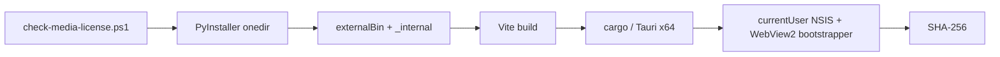

# 开发指南

## 工具链

| 场景 | 必需工具 |
|---|---|
| API / Web | Windows 10/11、Python 3.11–3.12、uv、Node.js 20+ |
| 桌面调试 | 上述工具 + Rust stable 1.77.2+、MSVC Build Tools |
| 安装包 | Windows x64、NSIS（由 Tauri 工具链获取）、网络用于 WebView2 bootstrapper |

系统 `ffmpeg.exe` 不是依赖。Faster-Whisper 通过 PyAV wheel 解码媒体；GPU 是可选能力。

> 当前锁定的 PyAV 18 Windows wheel 含 x264/x265，许可证门禁会有意阻止 sidecar 打包，因此 `desktop:dev` 与 `desktop:build` 在替换为合规媒体 wheel 前都会停止。API / Web 调试和全部源码测试不受影响；不要为方便开发把 `-AllowGpl` 写入默认脚本。

## 初始化与调试

```powershell
.\scripts\setup.ps1
.\scripts\dev.ps1
```

桌面调试会先生成 PyInstaller onedir sidecar，再启动 Vite 和 Tauri：

```powershell
npm --prefix web run desktop:dev
```

主要目录：

| 路径 | 内容 |
|---|---|
| `src/sublingo_local/` | Python API、流水线和 Provider |
| `tests/` | Python 测试 |
| `web/` | React/Vite 界面 |
| `src-tauri/` | Tauri Rust 壳、权限和 NSIS 配置 |
| `packaging/` | PyInstaller 入口与 spec |
| `scripts/` | 初始化、sidecar、桌面与许可证门禁脚本 |

## 验证矩阵

```powershell
uv run --extra asr --extra dev pytest
uv run --extra dev ruff check .
npm --prefix web run lint
npm --prefix web run build
cargo check --manifest-path src-tauri\Cargo.toml --target x86_64-pc-windows-msvc
```

真实浏览器至少覆盖：页面无 console error、环境刷新、模型状态/下载按钮、三种目标语言、Provider 字段切换、创建任务与完成态路径。桌面改动还需验证：随机端口、错误令牌返回 401、退出后 sidecar 消失、安装/卸载均不需要管理员权限。

## 构建过程



一键命令：

```powershell
npm --prefix web run desktop:build
```

生成位置为 `src-tauri/target/x86_64-pc-windows-msvc/release/bundle/nsis/`。不要直接执行 `tauri build`，否则 clean checkout 缺少 sidecar 与媒体许可证证据。

也不要用裸 `cargo build --release` 验证生产界面。直接 Cargo 构建不会建立 Tauri 的生产环境上下文，EXE 可能仍带 `cfg(dev)` 并访问 `devUrl` 的 `127.0.0.1:5173`，从而误显示本机其他开发服务。只做不打安装包的本地隔离验证时，应先按正式步骤准备 sidecar，再使用仓库锁定的 Tauri CLI：

```powershell
.\web\node_modules\.bin\tauri.cmd build --config src-tauri\tauri.conf.json --target x86_64-pc-windows-msvc --no-bundle
```

## 关键约束

- `faster_whisper` 必须延迟导入，缺 GPU 依赖时 Web UI 和单测仍能启动。
- 翻译器必须实现统一 Provider 接口；API Key 不得进入日志或持久文件。
- Codex Spark 只能通过本机 `codex exec` 与现有登录调用。
- 时间轴由程序持有，模型只翻译稳定 ID。
- 外部进程调用必须传参数数组，禁止拼接 shell 命令。
- 不要提交 `src-tauri/binaries/_internal`、PyInstaller build/dist 或模型文件。
