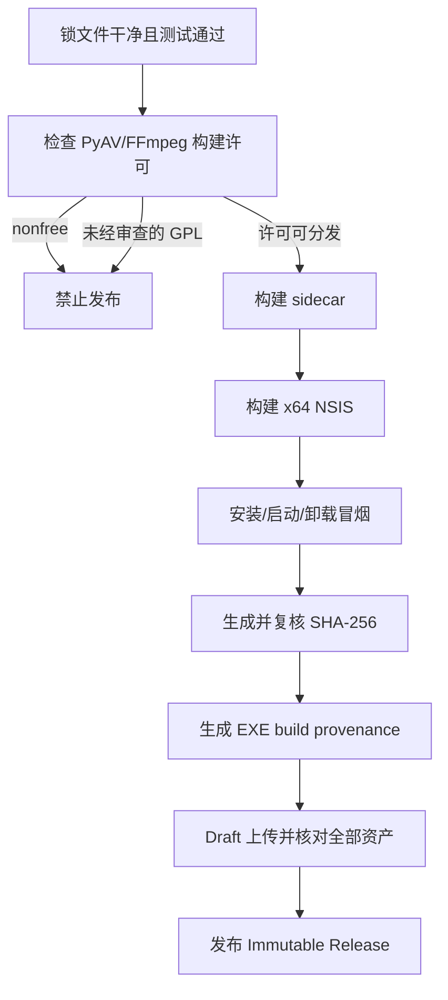
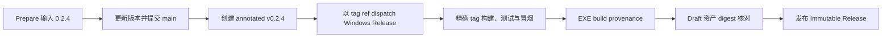

# Windows 发布指南

## M5 发行物

| 产物 | 支持状态 |
|---|---|
| Windows x64 NSIS | 已在 GitHub Actions 构建并完成安装/卸载冒烟 |
| 当前用户安装、无管理员权限 | 已配置 `currentUser` |
| WebView2 bootstrapper | 已内置 `embedBootstrapper` |
| Python/Faster-Whisper/PyAV sidecar | PyInstaller onedir |
| SHA-256 | 构建脚本与 Release workflow 自动生成 |
| PyAV/FFmpeg 许可证门禁 | 默认 fail closed；正式 workflow 构建锁定的 LGPL FFmpeg 8.1.2 + PyAV 18.0.0 wheel |
| 构建证据 | 随产物提供 `FFMPEG_BUILD_INFO.txt` 与 `MEDIA_WHEEL_PROVENANCE.json` |
| EXE build provenance | `actions/attest` 使用 GitHub OIDC 为最终安装包生成可验证证明 |
| Immutable Release | 已启用；发布后 tag、commit 和全部 Release assets 由 release attestation 绑定且不可替换 |
| Authenticode | **尚未配置** |
| 自动更新 | **尚未启用**；没有签名元数据前不得开启 |

## 发布前门禁



推荐发布入口是 GitHub Actions 的 `Prepare Release`。维护者从 `main` 手动输入不带 `v` 的版本号（例如 `0.2.4`）及是否为预发布。该 workflow 更新全部项目版本、提交 `main`、创建绝不移动的 annotated tag，然后以该 tag 作为 workflow ref 显式 dispatch 独立的 `Windows Release`。之所以显式 dispatch，是因为使用 `GITHUB_TOKEN` 推送 tag 不会递归触发新的 workflow run。

`Windows Release` 只接受既有 tag，精确 checkout 后同时校验：`GITHUB_REF` 是该 tag、`GITHUB_SHA` 等于 tag commit、tag 是 annotated tag、项目版本等于 tag 版本。之后才构建、测试、执行许可证门禁与安装冒烟；全部通过后为最终 EXE 生成 build provenance，创建或恢复 Draft Release，逐个比对四项资产的名称、大小和 GitHub SHA-256 digest，最后发布 Immutable Release。

`actions/attest` 固定为完整提交 `f7c74d28b9d84cb8768d0b8ca14a4bac6ef463e6`（v4.2.0），只传最终 EXE 的 `subject-path`，并记录官方 action 输出的 `attestation-id` 与 `attestation-url`。Release job 的权限边界是 `contents: write`（Draft/Release）、`id-token: write`（GitHub OIDC）和 `attestations: write`（写入证明）；Prepare 另有 `actions: write` 用于独立 dispatch。流程不引入 secret、证书文件或长期私钥。

仓库还必须存在 active tag ruleset：包含 `refs/tags/v*`、同时限制 update 与 deletion、没有 bypass actor，且 workflow token 不可 bypass。Release run 会在构建开始和最终 publish PATCH 紧邻前各验证一次；active、tag target、精确 include、空 exclude、update 与 deletion 始终 fail closed。GitHub 的 ruleset API 只在调用者拥有 ruleset 写权限时返回 `bypass_actors`，但 `current_user_can_bypass` 仍可能对普通 `GITHUB_TOKEN` 可见。因此校验采用精确三态：`bypass_actors` 可见时必须为 `[]`，并且 `current_user_can_bypass` 必须同时可见且为 `never`；`bypass_actors` 不可见时，只接受 current 字段也缺失或严格为 `never`，这两种情况都会带告警继续，并在日志和 Job Summary 明确标记“管理员 bypass 列表是外部前置条件，未由本次 workflow 验证”；`bypass_actors` 缺失但 current 字段为其他值或空值，以及 `bypass_actors` 可见但 current 字段缺失，都会立即 fail closed。最终门禁还会重新读取远端 annotated tag 的 peeled commit，并要求它同时等于 `RELEASE_TAG_COMMIT` 和 `GITHUB_SHA`。规则失效、可见 bypass 状态不安全、管理员字段出现不安全非对称响应、tag 被删除/改成 lightweight tag 或 commit 发生变化时，Draft 可以保留供诊断，但绝不会发送 publish PATCH。

管理员必须在仓库 `Settings` → `Rules` → `Rulesets` 中确认 tag ruleset 的 bypass list 为空，或使用具备仓库 Administration 权限的临时本地身份检查 `gh api repos/coconilu/captionnest/rulesets/19140023`，确认 `bypass_actors=[]`、`current_user_can_bypass=never`。不要把管理员 token 存入 Actions secret，也不要为读取这两个字段给 Release job 增加 Administration 写权限；GitHub Actions 没有可安全授予的 `administration: read` workflow 权限。详见 [Repository rules REST API](https://docs.github.com/en/rest/repos/rules?apiVersion=2026-03-10)。

官方依据：[actions/attest v4.2.0](https://github.com/actions/attest/tree/v4.2.0)、[使用 Artifact Attestations](https://docs.github.com/en/actions/how-tos/secure-your-work/use-artifact-attestations/use-artifact-attestations)、[Immutable Releases](https://docs.github.com/en/code-security/concepts/supply-chain-security/immutable-releases)、[验证 Release 完整性](https://docs.github.com/en/code-security/how-tos/secure-your-supply-chain/secure-your-dependencies/verify-release-integrity)。



Release 说明不调用 AI。固定模板包含 Windows 下载、三种在线验证命令、build provenance URL、SmartScreen 与 LGPL 构建证据说明。

维护者的唯一发布操作如下：

| 操作 | 值 |
|---|---|
| 打开 | `Actions` → `Prepare Release` → `Run workflow` |
| 分支 | `main` |
| `version` | 新版本号，例如 `0.2.4`，不要带 `v` |
| `prerelease` | 正式版保持关闭，测试版打开 |

## 失败与安全重试

新架构刻意接受“已经有 tag、尚无 Release”这一可恢复状态。失败时不得删除或移动 tag 来伪装重建：

| 失败状态 | 安全重试语义 |
|---|---|
| 版本提交前失败 | 修复原因后从 `main` 重跑 `Prepare Release` |
| 已提交版本、尚未创建 tag | 用相同版本和 `prerelease` 重跑；版本更新幂等，tag 固定到当前版本提交 |
| tag 已存在、无 Release | 用相同输入重跑 `Prepare Release`；它只会验证 annotated tag、版本、main 历史与 tag 元数据，再次 dispatch |
| Draft Release 已存在 | 对同一 tag 重跑 `Windows Release`；仅允许覆盖该 Draft 中四个预期同名资产，随后重新核对完整集合与 digest |
| Release 已发布 | 永久拒绝覆盖或移动 tag；任何修复必须发布新版本 |

`v0.2.2` 和 `v0.2.3` 都是已知失败发布留下的受保护 annotated tag，且都没有对应 Draft 或 Release。`v0.2.2` 因管理员字段完全不可见时的旧误判失败；`v0.2.3` 的 run 29642143052 因生产 API 合法返回“`bypass_actors` 缺失、`current_user_can_bypass=never`”而被旧 XOR 规则误判。不得移动或删除这两个 tag，本修复合并后的首次发布必须使用新版本 `v0.2.4`。

构建、测试、许可证检查、安装冒烟、`actions/attest`、Draft 资产上传或 digest 核对任一步失败，都不会发布最终 Release。与旧流程不同，失败时**可能已经留下版本提交和 tag**；这是确保 attestation source commit 与 Release tag commit 完全一致的必要边界。

## 下载后的验证

在克隆过本仓库并 fetch tag 的目录中，用 Release 的真实 tag 和文件名替换示例值：

```powershell
$Tag = 'v0.2.4'
$Installer = '.\CaptionNest_0.2.4_x64-setup.exe'
$TagCommit = (git rev-parse "$Tag^{commit}").Trim()

gh attestation verify $Installer `
  -R coconilu/captionnest `
  --signer-workflow coconilu/captionnest/.github/workflows/release.yml `
  --source-ref "refs/tags/$Tag" `
  --source-digest $TagCommit `
  --format json

gh release verify $Tag -R coconilu/captionnest
gh release verify-asset $Tag $Installer -R coconilu/captionnest
```

成功结果至少要交叉检查以下事实：

| 检查项 | 预期 |
|---|---|
| repository / signer workflow | `coconilu/captionnest` / `.github/workflows/release.yml` |
| source ref / commit | `refs/tags/v0.2.4`，且 commit 等于 `git rev-parse "v0.2.4^{commit}"` |
| build provenance subject digest | 等于本地 EXE 的 SHA-256，也等于同名 `.sha256` 首列 |
| release attestation | tag、commit 与 Release 中全部资产均被 GitHub 的发布证明覆盖 |

本地摘要可独立交叉检查：

```powershell
$Actual = (Get-FileHash $Installer -Algorithm SHA256).Hash.ToLowerInvariant()
$Recorded = ((Get-Content "$Installer.sha256" -Raw).Trim() -split '\s+')[0]
if ($Actual -ne $Recorded) { throw 'EXE 与发布的 .sha256 不一致。' }
```

篡改测试必须失败；不要在原下载文件上操作：

```powershell
$Tampered = '.\CaptionNest_tampered.exe'
Copy-Item $Installer $Tampered
[IO.File]::AppendAllText((Resolve-Path $Tampered), 'tampered')
gh attestation verify $Tampered -R coconilu/captionnest
if ($LASTEXITCODE -eq 0) { throw '篡改后的文件不应通过验证。' }
```

## 证明边界

| 机制 | 能证明 | 不能证明 |
|---|---|---|
| `.sha256` | 下载字节与记录摘要相同 | 摘要记录来自谁、由哪个 workflow 构建 |
| build provenance | 最终 EXE 摘要、仓库、构建 workflow、source ref/commit | 软件无漏洞/恶意行为、Windows 发布者信誉 |
| release attestation | Immutable Release 的 tag、commit 和全部 assets | 单个 EXE 的详细构建步骤；它不替代 build provenance |
| SBOM | 组件清单（本 Issue 尚未生成最终产物级 SBOM） | 构建身份、代码签名或组件安全性 |
| Authenticode | Windows 发布者身份、签名完整性和可选时间戳（当前未配置） | GitHub 构建来源与完整依赖清单 |

等价的本机构建需要先 bootstrap 与 `tooling/packaging/media-runtime/vcpkg.json` 相同 baseline 的 vcpkg：

```powershell
npm ci --prefix apps/web
uv sync --project apps/sidecar --extra asr --extra desktop --extra dev --locked
$Python = (Resolve-Path 'apps\sidecar\.venv\Scripts\python.exe').Path
.\scripts\build-media-wheel.ps1 -VcpkgRoot C:\path\to\vcpkg -PythonExecutable $Python
& $Python -m pytest
npm --prefix apps/web run lint
.\scripts\build-desktop.ps1 -PythonExecutable $Python
```

`scripts/build-desktop.ps1` 会依次生成媒体许可证证据、sidecar、NSIS 和校验和。门禁会同时检查 FFmpeg 配置、自报许可证和 PyAV wheel 实际携带的 DLL。检测到 `--enable-nonfree` 会无条件中止；检测到 `--enable-gpl` 或已知 GPL 外部库配置/DLL 时默认中止；无法读取完整元数据或无法在 Windows 上枚举 bundled DLL 时同样中止，避免把检测失败误当作许可通过。

版本准备由 `tooling/release/version.py` 一次性更新 Python、Web、Tauri、Cargo 及对应 lock 文件；它会先验证全部目标再写盘，避免只更新一部分。Prepare 在推送版本提交前再次确认远端 `main` 没有移动，然后创建带 `prerelease` 标记的 annotated tag。独立的 tag-ref Release run 使用 `scripts/check-version-consistency.ps1` 重新核对全部声明，并且绝不写版本、提交或 tag。

官方 PyAV 18.0.0 Windows wheel 自报 LGPL，但构建配置和实际 DLL 包含 x264/x265，因此仍会按设计失败。这不是误报，也不能通过删除证据文件或只采信自报许可证绕过。正式 workflow 不使用该 wheel，而是从已校验哈希的 PyAV 源码构建 wheel，链接由锁定 vcpkg baseline 生成且未启用 GPL/nonfree/x264/x265 的 FFmpeg，并保存 wheel、源码和构建输入的哈希证据。

只有发行负责人已完成最终组合产物的 GPL 许可证、对应源代码、修改记录、构建与再链接义务审查，才能单独执行以下检查：

```powershell
.\scripts\check-media-license.ps1 -AllowGpl -OutputPath 'tooling\packaging\dist\FFMPEG_BUILD_INFO.txt'
```

`-AllowGpl` 会把显式覆盖状态和全部 GPL 命中项写入证据；它不会被 `build-desktop.ps1` 或 Release workflow 自动启用。完成审查后仍需由发行负责人有意识地调整正式构建流程，禁止把该参数作为普通 CI 默认值。

## Clean checkout 要求

正式构建只能从 clean checkout 开始。构建入口必须是 `npm --prefix apps/web run desktop:build` 或相同的 `scripts/build-desktop.ps1`，因为它会先生成以下 Tauri resource：

| 资源 | 来源 |
|---|---|
| `apps/desktop/binaries/captionnest-sidecar-...exe` | PyInstaller |
| `apps/desktop/binaries/_internal/` | PyInstaller onedir 依赖 |
| `tooling/packaging/dist/FFMPEG_BUILD_INFO.txt` | 实际 PyAV wheel 检测 |
| `LICENSE` / `THIRD_PARTY_NOTICES.md` / `licenses/` | 仓库已审阅文件 |

许可证证据至少应包含 PyAV 版本、FFmpeg 配置、自报许可证、wheel 携带的 DLL 文件名、GPL 命中项、是否显式覆盖以及最终门禁决定。仅有 `LGPL version 3 or later` 自报字段不足以证明最终 wheel 可按 LGPL 发布。

## 安装冒烟

| 验证 | 预期 |
|---|---|
| 非管理员账户安装 | 安装到 `%LOCALAPPDATA%`，无 UAC |
| 无 Python/Node/FFmpeg 的干净 Windows | 应用可启动并显示环境页 |
| 首次启动 | sidecar 健康后主窗口出现 |
| 模型下载 | 写入应用数据目录，重启仍可检测 |
| 任务处理 | 得到唯一双语 SRT |
| 退出 | sidecar 进程随主程序退出 |
| 卸载 | 程序文件删除；用户模型/数据的保留策略需在卸载说明中明确 |

## 签名与自动更新边界

当前安装包是未签名 MVP，可能触发 SmartScreen。启用正式分发前应：

1. 取得组织的 Windows Authenticode 代码签名证书，保护私钥并在 CI 使用最小权限签名服务；
2. 对最终安装器签名并验证时间戳，再生成 SHA-256；
3. 若启用 Tauri updater，另行创建 updater 签名密钥、发布公钥和签名更新元数据；
4. 对签名失败、过期、降级和离线场景做测试。

不能把 GitHub Release、HTTPS 或 SHA-256 当成 Authenticode/更新签名的替代品。在上述闭环完成前，仓库不配置 updater endpoint，也不宣称自动更新。

## 第三方许可证

发行负责人必须审阅 [第三方软件声明](../THIRD_PARTY_NOTICES.md) 和安装包内的 `FFMPEG_BUILD_INFO.txt`。本项目 Apache-2.0 只覆盖自有代码，不覆盖 PyAV、FFmpeg、Python、Tauri、WebView2、模型或其他依赖。
