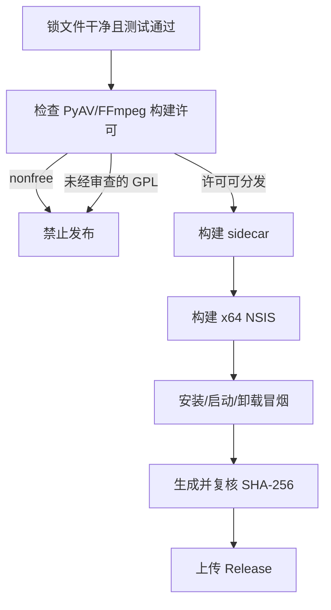

# Windows 发布指南

## M5 发行物

| 产物 | 支持状态 |
|---|---|
| Windows x64 NSIS | 已在 GitHub Actions 构建并完成安装/卸载冒烟 |
| 当前用户安装、无管理员权限 | 已配置 `currentUser` |
| WebView2 bootstrapper | 已内置 `embedBootstrapper` |
| Python/Faster-Whisper/PyAV sidecar | PyInstaller onedir |
| SHA-256 | 构建脚本与 Release workflow 自动生成 |
| PyAV/FFmpeg 许可证门禁 | 默认 fail closed；正式 workflow 构建锁定的 LGPL FFmpeg 8.1.2 + PyAV 18.0.0 wheel |
| 构建证据 | 随产物提供 `FFMPEG_BUILD_INFO.txt` 与 `MEDIA_WHEEL_PROVENANCE.json` |
| Authenticode | **尚未配置** |
| 自动更新 | **尚未启用**；没有签名元数据前不得开启 |

## 发布前门禁



推荐构建入口是 GitHub Actions 的 `Windows Release`。推送 `v*` tag 或手动运行 workflow 后，它会依次完成锁定媒体 wheel 构建、许可证门禁、测试、NSIS 封装和候选产物上传。首次构建 FFmpeg 较慢，后续构建使用 vcpkg binary cache。

等价的本机构建需要先 bootstrap 与 `packaging/media-runtime/vcpkg.json` 相同 baseline 的 vcpkg：

```powershell
npm ci --prefix web
uv sync --extra asr --extra desktop --extra dev --locked
$Python = (Resolve-Path '.venv\Scripts\python.exe').Path
.\scripts\build-media-wheel.ps1 -VcpkgRoot C:\path\to\vcpkg -PythonExecutable $Python
& $Python -m pytest
npm --prefix web run lint
.\scripts\build-desktop.ps1 -PythonExecutable $Python
```

`scripts/build-desktop.ps1` 会依次生成媒体许可证证据、sidecar、NSIS 和校验和。门禁会同时检查 FFmpeg 配置、自报许可证和 PyAV wheel 实际携带的 DLL。检测到 `--enable-nonfree` 会无条件中止；检测到 `--enable-gpl` 或已知 GPL 外部库配置/DLL 时默认中止；无法读取完整元数据或无法在 Windows 上枚举 bundled DLL 时同样中止，避免把检测失败误当作许可通过。

版本号由 `scripts/check-version-consistency.ps1` 统一核对 Python、Web、Tauri 和 Cargo 四处声明。推送 `v*` tag 只构建并保存候选产物；完成干净 Windows 的安装、运行、退出和卸载冒烟后，发行负责人必须在该 tag 上手动运行 `Windows Release`，勾选 `publish_release`，并通过 `release` environment 审批后才会附加到 GitHub Release。

官方 PyAV 18.0.0 Windows wheel 自报 LGPL，但构建配置和实际 DLL 包含 x264/x265，因此仍会按设计失败。这不是误报，也不能通过删除证据文件或只采信自报许可证绕过。正式 workflow 不使用该 wheel，而是从已校验哈希的 PyAV 源码构建 wheel，链接由锁定 vcpkg baseline 生成且未启用 GPL/nonfree/x264/x265 的 FFmpeg，并保存 wheel、源码和构建输入的哈希证据。

只有发行负责人已完成最终组合产物的 GPL 许可证、对应源代码、修改记录、构建与再链接义务审查，才能单独执行以下检查：

```powershell
.\scripts\check-media-license.ps1 -AllowGpl -OutputPath 'packaging\dist\FFMPEG_BUILD_INFO.txt'
```

`-AllowGpl` 会把显式覆盖状态和全部 GPL 命中项写入证据；它不会被 `build-desktop.ps1` 或 Release workflow 自动启用。完成审查后仍需由发行负责人有意识地调整正式构建流程，禁止把该参数作为普通 CI 默认值。

## Clean checkout 要求

正式构建只能从 clean checkout 开始。构建入口必须是 `npm --prefix web run desktop:build` 或相同的 `scripts/build-desktop.ps1`，因为它会先生成以下 Tauri resource：

| 资源 | 来源 |
|---|---|
| `src-tauri/binaries/captionnest-sidecar-...exe` | PyInstaller |
| `src-tauri/binaries/_internal/` | PyInstaller onedir 依赖 |
| `packaging/dist/FFMPEG_BUILD_INFO.txt` | 实际 PyAV wheel 检测 |
| `LICENSE` / `THIRD_PARTY_NOTICES.md` / `licenses/` | 仓库已审阅文件 |

许可证证据至少应包含 PyAV 版本、FFmpeg 配置、自报许可证、wheel 携带的 DLL 文件名、GPL 命中项、是否显式覆盖以及最终门禁决定。仅有 `LGPL version 3 or later` 自报字段不足以证明最终 wheel 可按 LGPL 发布。

## 安装冒烟

| 验证 | 预期 |
|---|---|
| 非管理员账户安装 | 安装到 `%LOCALAPPDATA%`，无 UAC |
| 无 Python/Node/FFmpeg 的干净 Windows | 应用可启动并显示环境页 |
| 首次启动 | sidecar 健康后主窗口出现 |
| 模型下载 | 写入应用数据目录，重启仍可检测 |
| 任务处理 | 得到唯一双语 SRT |
| 退出 | sidecar 进程随主程序退出 |
| 卸载 | 程序文件删除；用户模型/数据的保留策略需在卸载说明中明确 |

## 签名与自动更新边界

当前安装包是未签名 MVP，可能触发 SmartScreen。启用正式分发前应：

1. 取得组织的 Windows Authenticode 代码签名证书，保护私钥并在 CI 使用最小权限签名服务；
2. 对最终安装器签名并验证时间戳，再生成 SHA-256；
3. 若启用 Tauri updater，另行创建 updater 签名密钥、发布公钥和签名更新元数据；
4. 对签名失败、过期、降级和离线场景做测试。

不能把 GitHub Release、HTTPS 或 SHA-256 当成 Authenticode/更新签名的替代品。在上述闭环完成前，仓库不配置 updater endpoint，也不宣称自动更新。

## 第三方许可证

发行负责人必须审阅 [第三方软件声明](../THIRD_PARTY_NOTICES.md) 和安装包内的 `FFMPEG_BUILD_INFO.txt`。本项目 Apache-2.0 只覆盖自有代码，不覆盖 PyAV、FFmpeg、Python、Tauri、WebView2、模型或其他依赖。
