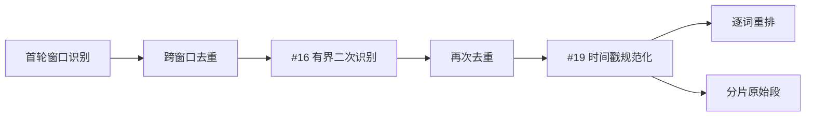

# 实验性时间戳规范化

CaptionNest 的时间戳规范化是一个默认关闭、可 A/B 对照的后处理步骤。它位于跨窗口去重与选择性二次识别之后、两种字幕渲染器之前，只调整程序持有的时间边界，不改变字幕文本、顺序、数量或稳定 ID。

## 上游研究与许可证

| 项目 | 固定证据 | CaptionNest 的使用方式 |
|---|---|---|
| stable-ts 仓库 | [`jianfch/stable-ts@e312072`](https://github.com/jianfch/stable-ts/tree/e312072cc024ae9fceb25b057d7d18524873a02b) | 研究其“按非语音区间收紧边界”和 gap adjustment 思路 |
| 静音抑制 | [`stable_whisper/stabilization/__init__.py`](https://github.com/jianfch/stable-ts/blob/e312072cc024ae9fceb25b057d7d18524873a02b/stable_whisper/stabilization/__init__.py) | 仅借鉴行为原则，未复制实现 |
| gap adjustment | [`stable_whisper/result.py`](https://github.com/jianfch/stable-ts/blob/e312072cc024ae9fceb25b057d7d18524873a02b/stable_whisper/result.py) | 仅借鉴优先使用非语音边缘的原则 |
| 许可证 | [MIT License](https://github.com/jianfch/stable-ts/blob/e312072cc024ae9fceb25b057d7d18524873a02b/LICENSE) | 未引入源码、包或运行时依赖；保留本页研究溯源 |

本实现是独立的 sample 级纯函数，不依赖 stable-ts、Whisper、PyTorch 或模型内部对象。与上游相比，它直接复用 CaptionNest #17 已有的一次共享 VAD，采用更小且固定的移动上限，冻结规范化前的字幕分组决策，并在任何结构不安全时保留原时间轴。

## 流水线位置

## 冻结规则

| 项目 | 规则 |
|---|---|
| 开关 | `timestamp_normalization=false` 为默认值；关闭时保持原时间轴且不新增 VAD 需求 |
| 时间单位 | 输入先转换为 sample 级半开区间，最终渲染时再转回秒和毫秒 |
| 有效停顿 | 只使用不少于 120 ms 的共享 VAD 非语音区间 |
| 静音收紧 | 起点落在静音内时尝试移到静音右边缘；终点落在静音内时尝试移到左边缘 |
| 最大移动 | 每个词或父分片的每个边界相对原值最多移动 300 ms |
| 最短时长 | 词和父分片均至少保留 100 ms；模型原始区间不足时在其他硬约束内确定性补足，无法补足则整轨回退且不得报告 `applied` |
| gap adjustment | 相邻边界之间存在可安全使用的静音时优先采用静音两侧；否则只对重叠或不超过 120 ms 的小 gap 使用确定性中点 |
| 长 gap | 只有静音两侧都满足 300 ms 上限时才吸附；没有合适静音时保持原值 |
| 分组 | “逐词重排”的停顿、时长、字符数和标点分组始终依据规范化前的时间轴，避免文本或稳定 ID 漂移 |
| 可读性补时 | 短字幕原有的最小时长补齐不得越过已知静音起点 |
| 失败 | 单个候选不安全时保留该原边界；最终结构违反不变量时整条轨道回退到原时间轴 |

## 必须保持的不变量

| 不变量 | 校验方式 |
|---|---|
| 媒体范围 | `0 <= start < end <= duration` |
| 顺序 | 父分片与逐词起止边界分别保持单调，不交换条目 |
| 父子包含 | 每个词必须完整位于对应父分片内 |
| 内容 | 文本、词数量、父分片数量与顺序完全不变 |
| 稳定身份 | 两种输出模式的字幕分组与 `seg-*` ID 不因校时而改变 |
| 有界性 | 每个边界相对规范化前的原值最多移动 300 ms |
| 确定性 | 相同输入、VAD 区间和策略必须得到字节级等价的结构与统计 |
| 无 VAD | VAD 不可用或没有合格非语音区间时精确保持原时间轴 |

## A/B 与诊断

诊断只保存数值，不保存字幕正文或媒体路径。除通用字幕数量、覆盖时长和字符数外，实验会记录字幕重叠次数/时长、边界侵入非语音的 sample 数、词/父分片边界移动次数、绝对移动总量、不安全候选数和整轨回退次数。

真实音视频验收结果记录在 [`.opc/qa/issue-19.md`](../.opc/qa/issue-19.md)。在证据足以证明收益前，该功能保持实验性且默认关闭。
