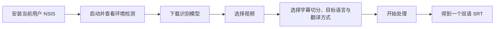

# 用户指南（Windows M1–M5）

## 从安装到字幕

## 环境卡片怎么处理

| 状态 | 含义 | 操作 |
|---|---|---|
| 本地运行时可用 | 安装包 sidecar 正常 | 无需操作 |
| 模型缺失 | 还没有所选识别模型或组合模型包 | 点击“下载模型”，等待完成 |
| CPU | 可正常使用，但长视频速度较慢 | 直接使用；CUDA 是可选优化 |
| Codex 未安装 | 只有 Codex Spark 不可用 | 点击官方安装入口；安装后点“重新检测” |
| Codex 未登录 | CLI 已安装但无 ChatGPT 登录 | 在终端执行 `codex login`，然后重新检测 |
| 媒体运行时异常 | PyAV/FFmpeg 打包不完整 | 重新安装官方 Release 并附版本报告问题 |

应用不会自动安装 Codex，也不会读取或保存 Codex 密码。LM Studio、DeepSeek 可在 Codex 不可用时独立使用。

## 输出规则

| 项目 | 规则 |
|---|---|
| 文件名 | `<视频名>.srt`，例如 `movie.srt` |
| 目标语言 | 不写入文件名；以任务中选择的语言为准 |
| 逐词重排 | 默认；按逐词时间戳切开长静音，适合直接观看 |
| 分片原始段 | 保留模型原始段落边界，适合诊断对照 |

每个任务只写一个文件。字幕块先写源语言，再换行写目标语言。如果同目录已有同名字幕，生成结果会覆盖该文件。如果源语言自动检测结果与目标语言相同，应用会提示更换目标语言，不会生成文件。

使用“选择本地视频”时，字幕默认写入视频同目录。普通拖放上传无法取得浏览器外的原绝对路径，因此应用会复制视频到应用数据目录，并在副本旁输出字幕。

## 模型与磁盘

| 模型 | 取舍 |
|---|---|
| small | 默认选项；下载小、CPU 更快、准确率相对低 |
| medium | 速度与准确率折中 |
| large-v3-turbo | 较快的大模型选择 |
| large-v3 | 高质量，下载和计算成本最高 |

下载前应用会检查磁盘空间。下载中断不会覆盖已可用模型；缺失或损坏时可重新下载。模型许可证由模型发布者决定，下载前应查看对应模型卡。

产品界面只提供 Faster-Whisper。Qwen3-ASR 与 ForcedAligner 仅保留为源码级实验兼容能力，
不再显示为用户模型选项；已有模型不会被自动删除。

## 常见问题

| 现象 | 建议 |
|---|---|
| 安装时出现 SmartScreen | M5 尚未配置 Authenticode；只从可信 Release 下载并核对 `.sha256` |
| 第一次启动较慢 | sidecar 与 WebView2 正在初始化；超过 30 秒仍无窗口请重新安装 |
| CPU 处理很慢 | 先改用 small/medium；GPU 支持是可选增强，不影响基本使用 |
| 字幕跨越很长静音 | 选择“逐词重排”；“分片原始段”主要用于诊断 |
| 目录不可写 | 将视频移到当前用户有写权限的目录，或使用拖放副本模式 |
| 翻译失败 | 检查 Codex 登录、LM Studio 服务或 DeepSeek 网络/API Key；识别结果不会因此上传 |
| Codex 安装后仍显示不可用 | 完全退出应用后重新打开，或先点“重新检测”；确认终端可执行 `codex --version` |
